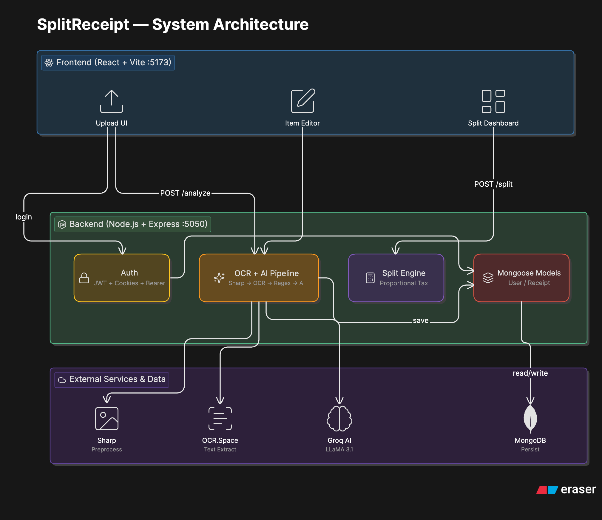
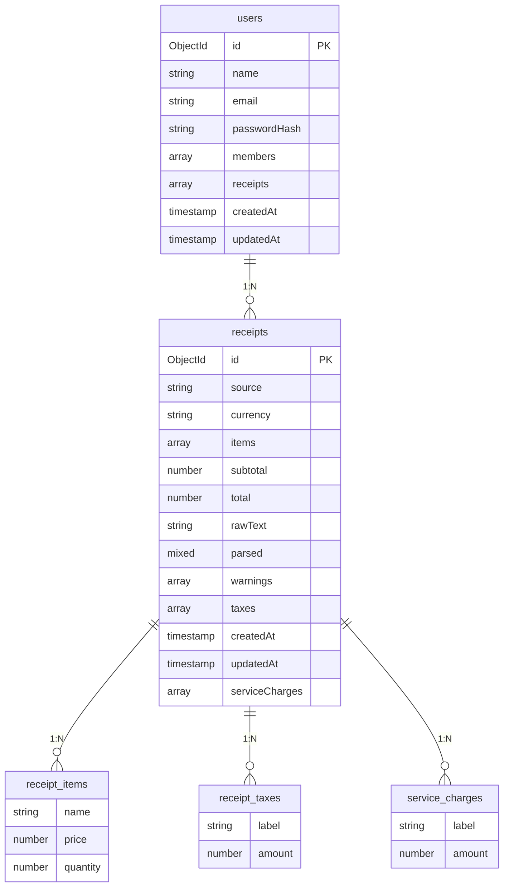

<p align="center">
  
</p>

<h1 align="center">SplitReceipt — Receipt OCR + Smart Bill Splitter</h1>

<p align="center">
  <strong>Upload a restaurant bill, extract items with OCR + AI, assign people, and split totals with taxes and service charges — automatically.</strong>
</p>

<p align="center">
  
  
  
  
</p>

---

## Table of Contents

1. [Problem Statement](#problem-statement)
2. [Our Solution](#our-solution)
3. [System Architecture](#system-architecture)
4. [OCR + AI Pipeline](#ocr--ai-pipeline)
5. [Tech Stack](#tech-stack)
6. [Project Structure](#project-structure)
7. [Database Schema](#database-schema)
8. [Features](#features)
9. [API Reference](#api-reference)
10. [Getting Started](#getting-started)
11. [Environment Variables](#environment-variables)

---

## Problem Statement

Splitting restaurant bills is painful when:

- **Long item lists** — Receipts with 10+ items are hard to parse manually
- **Hidden charges** — Taxes, service charges, and GST are unclear or buried in fine print
- **Everyone ordered differently** — Fair splitting requires per-item assignment, not equal division
- **Manual math = mistakes** — Calculator-based splitting leads to errors and arguments

> **Result:** Wasted time, wrong amounts, and awkward conversations at every group meal.

---

## Our Solution

**SplitReceipt** automates the entire flow — from scanning to splitting:

| Step | What Happens |
|------|-------------|
| **Upload** | Take a photo of any restaurant receipt and upload it |
| **OCR Scan** | Image is preprocessed with Sharp, then sent to OCR.Space for text extraction |
| **AI Parse** | Raw OCR text is cleaned with regex, then Groq AI (LLaMA 3.1) extracts structured JSON — items, prices, taxes, totals |
| **Edit** | Review extracted items, fix any errors, or add missing items manually |
| **Assign** | Add group members and assign each item to whoever ordered it |
| **Split** | Taxes and service charges are divided proportionally — see exactly who owes what |

---

## System Architecture



---

## OCR + AI Pipeline

### Step 1: Image Preprocessing

The uploaded receipt image is processed with **Sharp** before OCR to maximize extraction accuracy:

| Operation | Purpose |
|-----------|---------|
| Grayscale | Remove color noise |
| Normalize | Equalize brightness/contrast |
| Sharpen | Enhance text edges |
| Threshold | Convert to high-contrast binary |

### Step 2: Text Extraction (OCR.Space)

The preprocessed image is sent to the OCR.Space API, which returns raw text — typically noisy, with formatting artifacts and inconsistent spacing.

### Step 3: Regex Cleanup

Before AI parsing, the raw text is cleaned with regex-based heuristics:

- Remove duplicate whitespace and line noise
- Normalize currency symbols and decimal formats
- Apply domain-specific hints (common receipt patterns)

### Step 4: AI Structuring (Groq — LLaMA 3.1 8B)

The cleaned text is sent to Groq's LLaMA 3.1 model, which extracts a structured JSON object:

```json
{
  "items": [
    { "name": "Margherita Pizza", "quantity": 1, "price": 350 },
    { "name": "Cold Coffee", "quantity": 2, "price": 180 }
  ],
  "subtotal": 530,
  "tax": 26.50,
  "serviceCharge": 53.00,
  "total": 609.50
}
```

### Full Pipeline Flow

```
  Receipt Photo
       │
       ▼
  ┌─────────────────────────┐
  │  Sharp Preprocessing    │
  │  grayscale → normalize  │
  │  sharpen → threshold    │
  └───────────┬─────────────┘
              ▼
  ┌─────────────────────────┐
  │  OCR.Space API          │
  │  Image → Raw Text       │
  └───────────┬─────────────┘
              ▼
  ┌─────────────────────────┐
  │  Regex Cleanup          │
  │  Noise removal + hints  │
  └───────────┬─────────────┘
              ▼
  ┌─────────────────────────┐
  │  Groq AI (LLaMA 3.1)   │
  │  Raw Text → JSON        │
  └───────────┬─────────────┘
              ▼
  Structured Receipt
  { items, taxes, total }
```

---

## Tech Stack

### Backend

| Technology | Purpose |
|------------|---------|
| **Node.js 18** | Runtime |
| **Express** | REST API framework |
| **MongoDB + Mongoose** | Document database for users and receipts |
| **Sharp** | Image preprocessing before OCR |
| **OCR.Space API** | Optical character recognition |
| **Groq API (LLaMA 3.1)** | AI-powered text-to-JSON parsing |
| **jsonwebtoken** | JWT-based authentication |
| **bcryptjs** | Password hashing |
| **HTTP-only Cookies** | Secure session management |

### Frontend

| Technology | Purpose |
|------------|---------|
| **React 18** | UI framework |
| **Vite** | Build tool and dev server |
| **PropTypes** | Runtime type checking |

---

## Project Structure

```
SplitReceipt/
├── README.md
├── assets/
│   └── logo.png                # Project logo
│
├── Backend/
│   ├── config/                 # Database connection, env config
│   ├── controllers/            # Route handlers (auth, receipt, split)
│   ├── middleware/              # JWT authentication guard
│   ├── models/                 # Mongoose schemas (User, Receipt)
│   ├── routes/                 # API route definitions
│   ├── services/               # OCR, AI parsing, split logic
│   └── server.js               # Express entry point
│
└── Frontend/
    └── src/
        ├── components/         # React UI components
        ├── App.jsx             # Root component
        └── main.jsx            # Vite entry point
```

---

## Database Schema

The application uses MongoDB with Mongoose. Receipts are stored as embedded subdocuments within the User document.



---

## Features

### Authentication
- **Email + Password Registration** — Secure account creation with bcrypt hashing
- **Login with JWT** — Session managed via HTTP-only cookies & Bearer tokens (fixes mobile 3rd-party cookie issues)
- **Persistent Sessions** — Auto-restore session on page reload

### Receipt Processing
- **Photo Upload** — Upload any receipt image (JPG, PNG)
- **OCR Extraction** — Sharp preprocessing + OCR.Space for accurate text recognition
- **AI Parsing** — Groq LLaMA 3.1 converts raw text into structured items, taxes, and totals
- **Manual Editing** — Fix incorrect items, adjust prices, or add missing entries
- **Editable Totals** — Manually correct extracted taxes and service charges if they were read incorrectly

### Bill Splitting
- **Add Group Members** — Add people who shared the meal
- **Per-Quantity Assignment** — Assign specific quantities of an item to each person (e.g., if 2 items were ordered, assign 1 to Person A and 1 to Person B)
- **Proportional Tax Split** — Taxes and service charges divided fairly based on each person's subtotal
- **Final Summary** — Clear breakdown of who owes what

### Data Persistence
- **Save Receipts** — All parsed receipts stored per user in MongoDB
- **Receipt History** — Revisit and review past splits

---

## API Reference

### Authentication

| Method | Endpoint | Auth | Description |
|--------|----------|------|-------------|
| `POST` | `/api/auth/register` | Public | Create a new account |
| `POST` | `/api/auth/login` | Public | Login and receive session cookie |
| `POST` | `/api/auth/logout` | Public | Clear session cookie |
| `GET` | `/api/auth/me` | Cookie | Get current authenticated user |

### Receipts (Authentication Required)

| Method | Endpoint | Auth | Description |
|--------|----------|------|-------------|
| `POST` | `/api/receipt/analyze` | Cookie | Upload image → OCR + AI parse → save to database |
| `POST` | `/api/receipt/split` | Cookie | Compute per-person totals with tax distribution |

---

## Getting Started

### Prerequisites

- **Node.js** 18+
- **MongoDB** (local or [MongoDB Atlas](https://www.mongodb.com/atlas))
- API keys for [OCR.Space](https://ocr.space/ocrapi) and [Groq](https://console.groq.com/)

### 1. Clone the Repository

```bash
git clone https://github.com/BhuvanSShetty/SplitReceipt.git
cd SplitReceipt
```

### 2. Backend Setup

```bash
cd Backend
npm install
```

Create `Backend/.env`:

```env
PORT=5050
MONGOURL=your_mongodb_connection_string
GROQ_API_KEY=your_groq_api_key
GROQ_MODEL=llama-3.1-8b-instant
GROQ_BASE_URL=https://api.groq.com/openai/v1
OCR_SPACE_API_KEY=your_ocr_space_key
OCR_LANGUAGE=eng
OCR_SPACE_ENDPOINT=https://api.ocr.space/parse/image
JWT_SECRET=your_jwt_secret
FRONTEND_ORIGIN=http://localhost:5173
```

```bash
npm run dev
```

### 3. Frontend Setup

```bash
cd Frontend
npm install
```

Create `Frontend/.env`:

```env
VITE_API_URL=http://localhost:5050
```

```bash
npm run dev
```

### 4. Open the App

Visit **http://localhost:5173** in your browser.

---

## Environment Variables

### Backend (.env)

| Variable | Default | Description |
|----------|---------|-------------|
| `PORT` | `5050` | Backend server port |
| `MONGOURL` | — | MongoDB connection string |
| `GROQ_API_KEY` | — | Groq API key for AI parsing |
| `GROQ_MODEL` | `llama-3.1-8b-instant` | Groq model name |
| `GROQ_BASE_URL` | `https://api.groq.com/openai/v1` | Groq API base URL |
| `OCR_SPACE_API_KEY` | — | OCR.Space API key |
| `OCR_LANGUAGE` | `eng` | OCR language code |
| `OCR_SPACE_ENDPOINT` | `https://api.ocr.space/parse/image` | OCR.Space endpoint URL |
| `JWT_SECRET` | — | Secret key for JWT signing |
| `FRONTEND_ORIGIN` | `http://localhost:5173` | Frontend URL for CORS |

### Frontend (.env)

| Variable | Default | Description |
|----------|---------|-------------|
| `VITE_API_URL` | `http://localhost:5050` | Backend API base URL |

---

<p align="center">
  Built by <a href="https://github.com/BhuvanSShetty">Bhuvan S Shetty</a>
</p>
